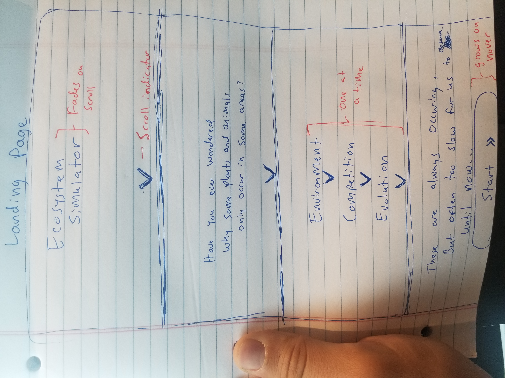
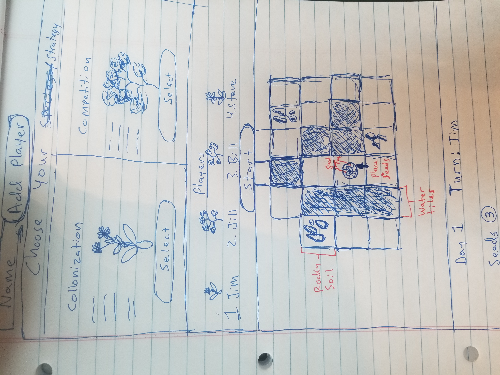
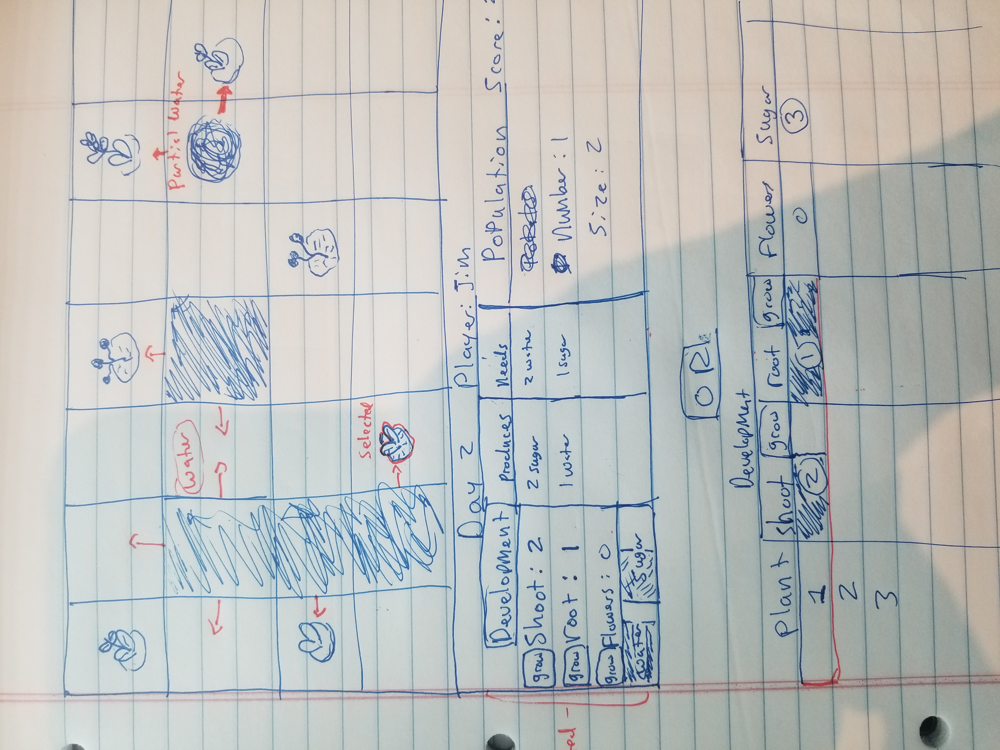
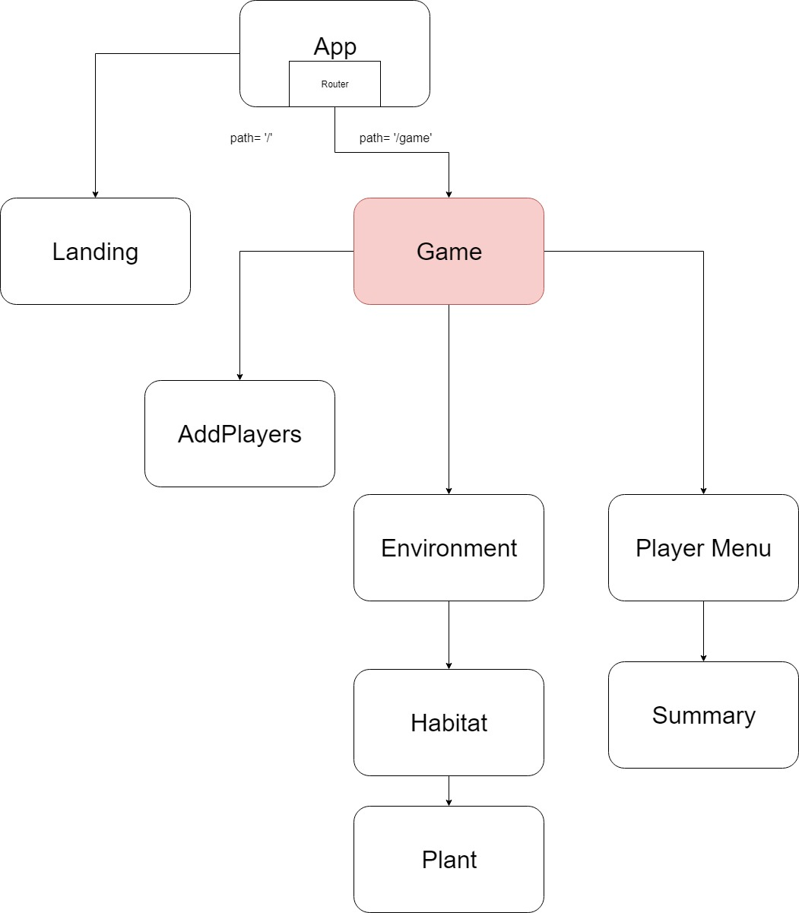

## Initial Planning for this game 

### Purpose: An interactive educational game about how biological communities are formed based on: 
1. Environmental Conditions 
2. Species Interactions
3. Adaptations and Evolution

### Goal: When the game ends points are awarded for:
•	Each individual in your population (more points for larger plants)
•	The number of seeds you have not yet planted

## Minimum Viable Product
### Features
1.	Landing Page that Describes Goal of Game

2.	Select Plant Species you will play as Menu:
* Forb 
	* Short life cycle (reaches maximum size sooner).
	* Grows and reproduces quickly, using less resources
	* After reproducing, will die and spread seeds.
* Shrub 
	* Long life cycle (can grow larger)
	* Takes longer to grow, but captures more resources
	* Can reproduce multiple times (only dying when out of resources).

3. Randomly Generated Environment Component

4.	Each player places several starting plants in environment. 

Creates a plant component with props based on state of Environmental Grid 

5.	Grow, Compete, and Reproduce

* Each day these methods are triggered:
* Water uptake: Removes water from Soil based on root size (up to total plant size). If other plants in habitat, they divide water based on root size.
* Photosynthesis:Uses plant water level based on shoot size. Creates sugar based on shoot size. If plants are next to each other, the smaller plant produces less sugar (shading).
* Flowers have chance of turning into seed: Randomly adds new plant nearby in grid.
*	Players take turn sugar to increase the size/number of their: Shoots, Roots, or Flowers
* Details about plants can be viewed when they are selected
* Day Increments once each player is done with their turn.
* Images for plants will change based on lifestage.

### Technologies used
6.	React, JavaScript, Redux and Jest
7.	WebPack, Babel, and ESLint (through create-react-app)
8.	Sass and CSS
9.	Figma (to draw graphics)

### Basic Component Tree

## Stretch Goals
### Features
1. Option to select Animal Species in Menu
* Animals eat plants and drink water to get energy.
* Use energy to move to different part of map, fight with other animals, and reproduce.
* Small Herbivore: Short lifecycle, Many offspring, Gets more sugars out of plants,
*	Large Omnivore: Long lifecycle, Fewer offspring,	Can eat smaller animals, but gets less energy from plants, Can store sugars in fat tissue
2.	User can select Map Size, Resource Levels, and Game Length.
3.	Environment is more Complex:
* Seasonal Events (Rain, Ice, Fire)
* Habitats are more continuous, less patchy
4.	Populations Evolve:
* Choose adaptations when new offspring are born: Added to new organism object, and can accumulate if selected later.
* Future offspring inherit adaptations
*	Plants:
Herbivore defenses (bitter compounds that make it harder to digest).
Reduce cost of roots, shoots, or flowers.
Attach seed to animal objects.
* Animals:
Movement speed increases
Can eat more leaves per turn
Increase fighting abilities
5.	Online Multiplayer Games (If still time)

### Technologies
6.	Redux and Local Storage
7.	Possibly SVG or Canvas for continuous habitats
8.	Online multiplayer would require firebase or other database/server.

